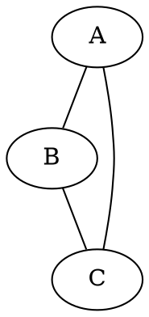

# Import, formats et limites web

## 1. Rôle de l'import

L'import transforme un fichier utilisateur en graphe exploitable par l'application.

Cette étape est critique car elle détermine :

- le nombre de nœuds ;
- le nombre d'arêtes ;
- la densité ;
- la lisibilité ;
- la performance.

---

## 2. Formats

### CSV

Chaque ligne peut être interprétée comme une entité.

Exemple :

```csv
id,x,y,z
A,1.0,2.0,3.0
B,1.1,2.1,2.9
C,8.0,3.0,1.0
```

### DOT

Exemple :



### Edge-list

Exemple :

```text
A B
B C
C D
```

---

## 3. Assistant d'import

Avant de charger réellement le graphe, l'application analyse :

- le format ;
- les lignes ;
- les colonnes ;
- les nœuds estimés ;
- les arêtes estimées ;
- le respect de la limite.

---

## 4. Limite par défaut

```text
Import externe : 1 000 nœuds
Démo générée : 400 nœuds
```

---

## 5. Pourquoi limiter ?

Un graphe trop grand peut provoquer :

- ralentissements ;
- illisibilité ;
- surconsommation mémoire ;
- interaction difficile ;
- perte d'intérêt visuel.

La version web privilégie une visualisation de qualité.

---

## 6. Limite paramétrable

La limite est modifiable dans le panneau Projet.

Cela permet d'adapter l'application au contexte.

Valeurs recommandées :

| Usage | Limite conseillée |
|---|---|
| Démo rapide | 150 à 300 |
| Présentation fluide | 300 à 500 |
| Analyse web normale | 500 à 1 000 |
| Machine puissante | plus de 1 000 avec prudence |

---

## 7. Échantillonnage

Si un graphe dépasse la limite, plusieurs choix sont possibles :

- premiers nœuds ;
- échantillon aléatoire ;
- nœuds les plus connectés ;
- annulation.

---

## 8. Recommandations CSV

Pour un CSV exploitable :

- nettoyer les colonnes inutiles ;
- garder les colonnes numériques pertinentes ;
- éviter les valeurs manquantes ;
- normaliser les données ;
- réduire les doublons.

---

## 9. Recommandations DOT

Pour un DOT propre :

- vérifier les nœuds isolés ;
- éviter les attributs non nécessaires ;
- réduire les graphes trop denses ;
- tester d'abord un petit extrait.
